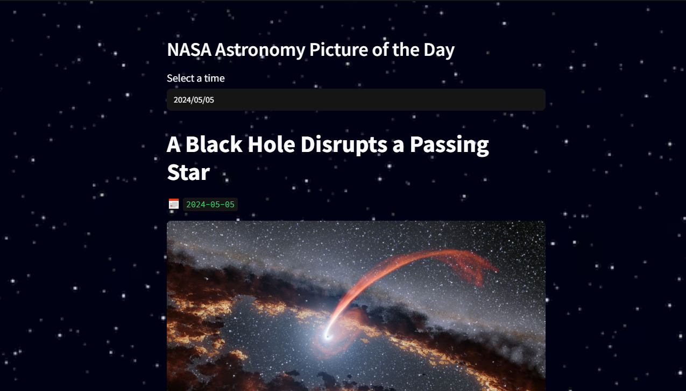

# 🌌 NASA Astronomy Picture of the Day (APOD) Viewer

*A Streamlit web app that displays NASA's Astronomy Picture of the Day with additional astronomical insights.*


## ✨ Features

- 🚀 Fetches and displays NASA's official Astronomy Picture of the Day
- 📅 View APODs from any date (current day by default)
- 🔍 Search and explore historical astronomical images
- 📝 Displays detailed explanations from NASA scientists




<br>

## 🛠️ Installation & Usage

### Prerequisites
- Python 3.8+
- NASA API key (free at [api.nasa.gov](https://api.nasa.gov))

### Quick Start
1. Clone the repository:
   ```
   git clone https://github.com/yourusername/nasa-apod-streamlit.git
   streamlit run main.py
   ```

<br>

## Documentation 📚
For more information, checkout https://apod.nasa.gov/apod/archivepix.html to access the official archive.
<br><br>


## Countribute 🤝
Feel free to contribute
<br><br>


## Communication 💌
* [Website](https://www.pariya-tavangar.ir)
* [Github](https://github.com/Ptavangar)
